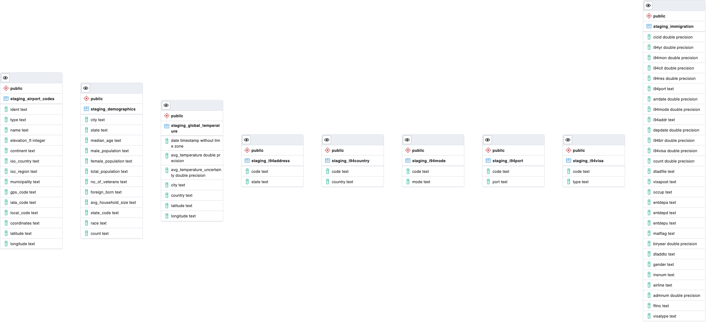
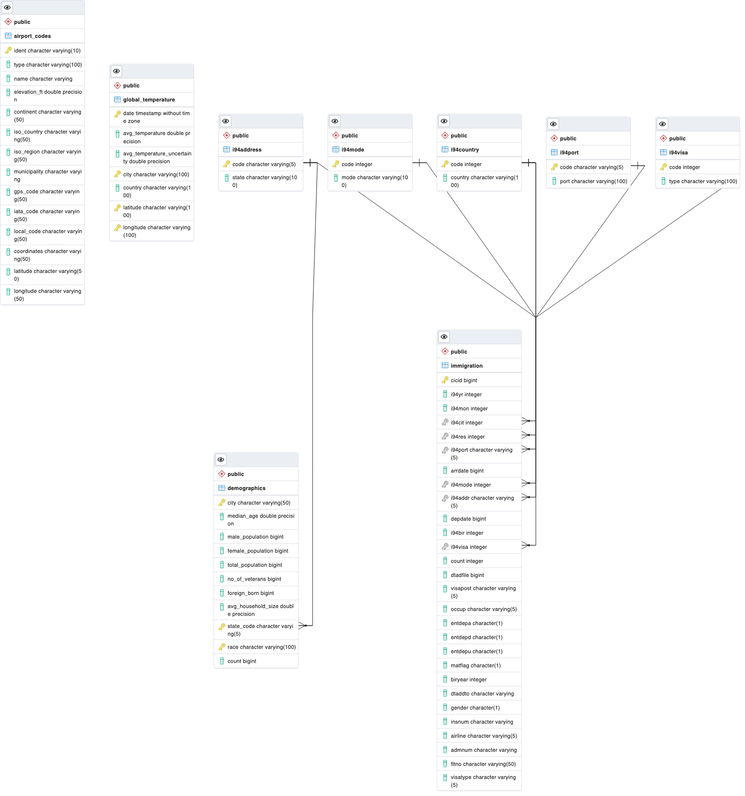
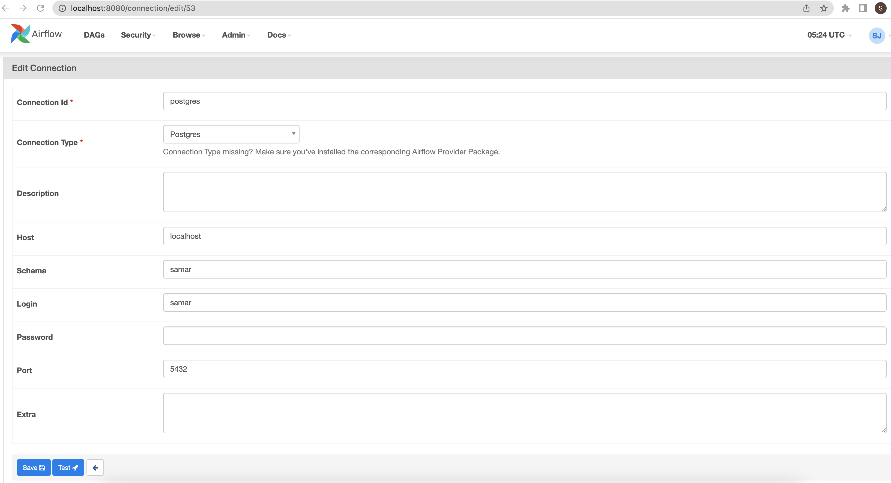
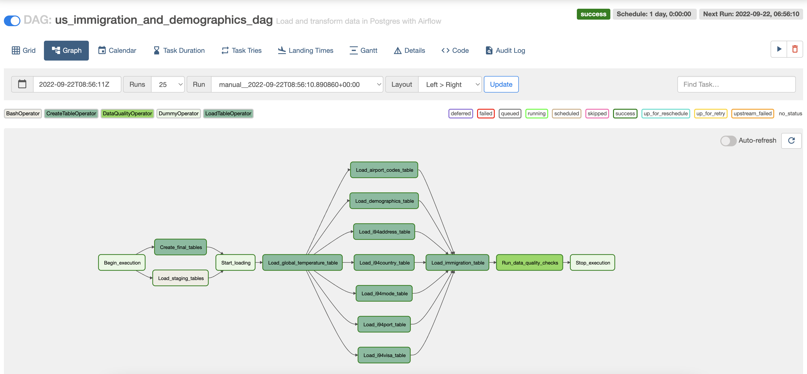

# Udacity's Nanodegree Data Engineering: US Immigration & Demographics Analysis

---

## About

This project is a part of Udacity's Nanodegree Data Engineering program in which the participating students have to build an ETL process. The purpose of the data engineering capstone project is to give a chance to combine what is learned throughout the program and implement. For this project I have chosen to complete the capstone project provided by Udacity itself.

This project intends to analyze the immigration and demographics data of US. Using the datasets, we can answer queries like:

* What mode of transport is highly used for immigration
* Demographics dataset should be directly proportional to immigration dataset
* What role does global temperature play in immigration
* What is Immigration per month or year
* What is the Immigration as per country of origin
* legal/illegal immigration

---

## Scope

Using the dataset of this project, we can analyze the immigration and demographics of US per state and year and how are they affected by different parameters in the dataset.

---

## The dataset used

1. I94 Immigration Data: This data comes from the US National Tourism and Trade Office, [here](https://travel.trade.gov/research/reports/i94/historical/2016.html)
2. World Temperature Data: This dataset came from Kaggle, [here](https://www.kaggle.com/datasets/berkeleyearth/climate-change-earth-surface-temperature-data)
3. U.S. City Demographic Data: This data comes from OpenSoft and contains information about the demographics of all US cities and census-designated places with a population greater or equal to 65,000, [here](https://public.opendatasoft.com/explore/dataset/us-cities-demographics/export/)
4. Airport Code Table: This is a simple table of airport codes and corresponding cities. The airport codes may refer to either IATA airport code, a three-letter code which is used in passenger reservation, ticketing and baggage-handling systems, or the ICAO airport code which is a four letter code used by ATC systems and for airports that do not have an IATA airport code, [here](https://datahub.io/core/airport-codes#data)

I have completed this project using Apache Spark, PostgreSQL and Apache Airflow.

---

## Project Repository

The repository contains the following files & folders:

* **dags:** contains us_immigration_and_demgraphics_dag.py script that creates the data pipeline that creates and loads staging tables, creates final tables, loads final tables from staging tables, runs data quality checks in Postgres Database

* **dl.cfg:** contains required Postgres configuration details

* **us_immigration_and_demgraphics.ipynb:** python notebook for gathering, exploring and cleaning the provided datasets. These are then used to create the respective staging tables in PostgreSQL.
Detailed explanation of the project can be found here

* **us_immigration_and_demgraphics_staging.py:** python script to create and load staging tables in postgres database

* **sql_queries:** All the truncate and insert queries are enlisted here

* **sql_create_tables.py:** Contains create queries for the final tables

* **drop_tables_sql:** sql script to drop all tha tables in the postgreSQL database. This is included only for reference and if a need occurs to execute it. Please note that it is not a part of the project data pipeline

* **plugins:** contains helpers, custom_operators and supporting files for the dag to execute error-free

* **images:** contains the images for Staging_diagram, ERD, Airflow_Postgres_conn, DAG, logs_Run_Data_Quality_Checks

* **data:** contains the following files - airport-codes_csv.csv, I94_SAS_Labels_Descriptions.SAS, immigration_data_sample.csv, us-cities-demographics.csv, sas_data parquet files, world temperature dataset

* **postgresql-42.5.5.jar:** jar file for postgres

* **logs:** Contains the project log files for reference

---

## Data Model

The data model consists of the following tables:

* immigration
* demographics
* airport_codes
* global_temperature
* i94country
* i94port
* i94mode
* i94address
* i94visa

### Staging Tables

### ERD

---

## Mapping Out & Running Data Pipelines

* In order to run the data pipeline using Airflow, make sure all the directory and folder structure are in the right order and accessible by Airflow by setting the PYTHONPATH correctly or importing via sys and sys.path.insert()
* Add postgresql-42.5.0.jar in config for Spark to use it to setup postgresql connection using jdbc
* Launch Airflow using the command - airflow scheduler and airflow webserver
* Access Airflow UI at localhost port-8080
* Activate and trigger us_immigration_and_demographics_dag to execute it

Steps necessary to pipeline the data into the chosen data model:

The data pipeline is scheduled to run once every month to analyze the change in the dataset. The scheduling is done via Apache Airflow.
The steps are as follows:

* Configure Postgres connection in Airflow UI, as:
    Admin >> Connections >> **+** Add a new record >> Do as below:

* Begin Execution
* Run task - load_staging_tables, this will execute the us_immigration_and_demographics_staging.py script inorder to create and load the staging tables in the postgresql database
* Run task - create_final_tables, this will create the final tables as per the ERD, described below
* Begin loading the final tables as per ERD with Start_loading dummy operator
* The first loading task is load_global_temperature_table as it contains a huge number of data and sometimes fails due to exitcode=<Negsignal.SIGKILL: -9>, hence to ensure that ths task is not failed by Airflow due to SIGTERM, the execution timeout for postgres has been increased to 3600 seconds. Also, other tables will start loading once this table is loaded successfully so that if it fails the entire dag run fails instantly.
* The rest of the tables are then loaded - load_airport_codes_table, load_demographics_table, load_i94address_table, load_i94country_table, load_i94mode_table, load_i94port_table, load_i94visa_table are run simultaneously
* Finally, the immigration table is loaded with load_immigration_table task
* Once all the tables are correctly loaded, Run_data_quality_checks is executed to confirm data quality
* Stop execution

---

## References

help taken from:
[spark](https://spark.apache.org/docs/2.2.1/sql-programming-guide.html)
[postgresOperator](https://airflow.apache.org/docs/apache-airflow-providers-postgres/stable/operators/postgres_operator_howto_guide.html)
[custom_operator](https://airflow.apache.org/docs/apache-airflow/stable/howto/custom-operator.html)
[modelues_management](https://airflow.apache.org/docs/apache-airflow/2.2.0/modules_management.html)
Udacity Classroom materials
Udacity Classroom Projects
Udacity's mentors

For more details on the project, please refer us_immigration_and_demographics_ipynb

---
